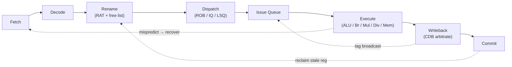
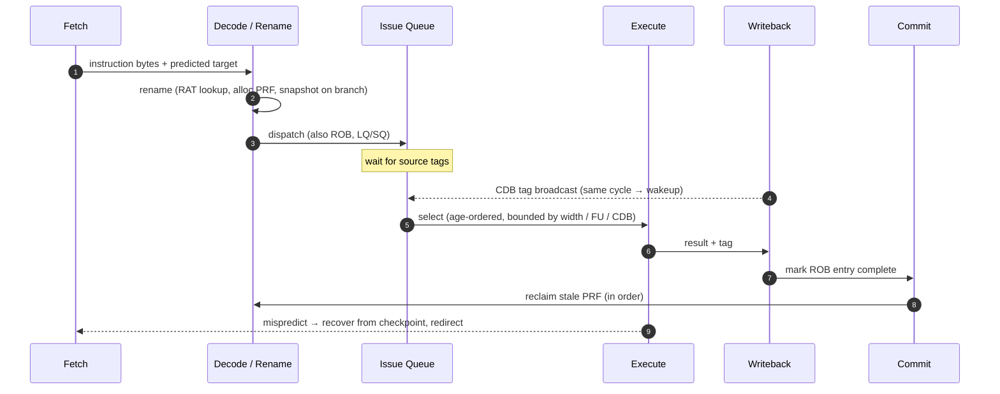

<div align="center">

# Mini-CPU

**A 7-stage out-of-order RV32IM CPU simulator**

`C++17` · `RISC-V` · `Cycle-accurate`

Single-core, cycle-accurate microarchitectural simulator implementing explicit
register renaming, a non-data-capture wakeup/select issue queue, store-to-load
forwarding, and gshare branch prediction with precise recovery.

</div>

---

## Contents

| § | Section | Summary |
|---|---|---|
| [1](#1-goals--non-goals) | Goals / Non-Goals | What the core does and deliberately does not do |
| [2](#2-system-architecture) | System Architecture | Pipeline stages and instruction lifecycle |
| [3](#3-register-renaming) | Register Renaming | Unified PRF, RAT, free list, stale-mapping reclaim |
| [4](#4-issue-queue) | Issue Queue | Non-data-capture wakeup, age-ordered select, CDB reservation |
| [5](#5-memory-subsystem) | Memory Subsystem | LSQ ordering, store-to-load forwarding, replay |
| [6](#6-branch-prediction--recovery) | Branch Prediction & Recovery | gshare, BTB, RAS, checkpoint-based rollback |
| [7](#7-data--control-flow-summary) | Data / Control Flow | End-to-end path through the pipeline |
| [8](#8-testing--validation) | Testing & Validation | Reference-interpreter differential testing |
| [9](#9-performance-characterization) | Performance Characterization | IPC across workloads and configurations |
| [10](#10-scope--future-work) | Scope / Future Work | ISA coverage and post-v1 directions |

---

## 1. Goals / Non-Goals

### Goals

| Goal | Mechanism |
|---|---|
| Precise, in-order commit despite out-of-order execution | ROB + checkpointed RAT/GHR/RAS |
| Zero false dependencies from register reuse | R10000-style renaming into a unified PRF |
| Back-to-back issue of dependent single-cycle ops | Intra-cycle Writeback → Issue wakeup path |
| Structural-hazard-free speculative wakeup | Fast-path ops reserve their CDB slot at select |
| Configurability without recompilation | Every structural parameter is a `Config` field |

### Non-Goals

- **Caches, TLBs, coherence.** Memory is a flat, always-hit array; `mem_latency` is a fixed load-use latency rather than a hit/miss distribution.
- **Privileged architecture.** No CSRs, no supervisor/machine mode split, no interrupts, RV32 only.
- **Multi-core / SMP.** Single hart. `FENCE` and `FENCE.I` retire as NOPs.
- **RTL fidelity.** This is a cycle-accurate C++ model, not synthesizable hardware.

---

## 2. System Architecture

The core is an in-order front end feeding an out-of-order back end, with in-order commit off the ROB head.

```
Fetch → Decode → Rename → Dispatch → Issue → Execute → Writeback
                                                          │
                                Commit (in order, from the ROB head)
```



### Instruction lifecycle

```
fetch → decode → rename (RAT lookup, alloc PRF, snapshot RAT on branch)
      → dispatch (ROB / IQ / LQ or SQ entry)
      → wait for operands via CDB broadcasts
      → select (age-ordered, bounded by width and FU/CDB availability)
      → execute → writeback (broadcast tag, write PRF)
      → commit in order, retire stores to memory, reclaim stale PRF
```

Stages are evaluated in **reverse pipeline order** (Commit → Writeback → Execute → Issue → Dispatch → Rename → Decode → Fetch) so each stage sees the previous cycle's output of its producer — the inter-stage queues behave as latches.

The single deliberate intra-cycle path is **Writeback → Issue**: a tag broadcast in cycle T clears ready bits *before* select runs in the same cycle T. This is what enables back-to-back issue of dependent single-cycle ops.

---

## 3. Register Renaming

### 3.1 R10000-style explicit renaming

Values live in a **unified physical register file** holding both committed and speculative state — not in the ROB. At rename an instruction:

1. Reads the RAT to translate architectural sources to physical tags.
2. Allocates a fresh physical register for its destination from the **free list**.
3. Records the **stale** mapping (the physical register the destination architectural reg was pointing to *before* this instruction) in its ROB entry.

At commit the stale register is returned to the free list. That is the only place registers are freed on the correct path.

```text
Before rename (arch → phys)     x5 → p12
Rename `x5 = x3 + x4`:
  sources  x3, x4  →  read RAT   → p8, p10
  dest     x5      →  alloc p27  → free_list.pop()
  RAT[x5] ← p27, ROB entry stores stale = p12
On commit:                       → free_list.push(p12)
```

| Property | Consequence |
|---|---|
| Sources renamed to physical tags | WAR hazards vanish (readers hold their own snapshot tag) |
| Destinations allocated fresh | WAW hazards vanish (each writer has a distinct tag) |
| Only RAW remains | Carried entirely by physical-tag matching in the IQ |

### 3.2 Sizing and starvation

`PRF = ROB + 32` makes register starvation impossible — every in-flight instruction can hold one new mapping on top of the 32 committed ones. Smaller values are legal and simply stall rename, which is what makes `--prf` worth sweeping. `Config::prf_can_starve()` reports whether a config is below the rule.

### 3.3 The `x0` special case

`x0` is never renamed: it keeps its reset mapping to `p0`, and an instruction writing `x0` allocates no destination at all. This preserves the RISC-V semantic (reads return zero, writes are discarded) without special-casing every reader.

### 3.4 RAT checkpoints

Branches take a snapshot of the RAT at rename — after the branch's own destination is mapped, since the branch itself survives a recovery targeted at instructions *younger* than it. Checkpoints are a finite pool; exhausting it stalls rename on the next branch. See [§6.4](#64-misprediction-recovery).

---

## 4. Issue Queue

### 4.1 Non-data-capture

Entries hold **source tags and ready bits, never values**. Operands are read from the PRF *after* select. This is what "non-data-capture" means: the IQ tracks readiness, the PRF stores values.

Two consequences:
- The IQ payload per entry is tiny (a handful of tag + flag bits), so a 16-entry queue costs almost nothing.
- Operands must be latched between Issue and Execute so a wakeup broadcast the same cycle cannot corrupt an already-selected op's reads.

### 4.2 Wakeup and select in one atomic cycle

`Cpu::tick()` evaluates stages in reverse pipeline order — Writeback runs *before* Issue in the same cycle. A CDB tag broadcast in cycle T clears ready bits *before* select runs in cycle T. This is the intra-cycle path that lets a dependent 1-cycle ALU op issue back-to-back with its producer.

The test suite pins this: **200 dependent `addi`s on a 1-wide machine complete in under 260 cycles.**

### 4.3 Two wakeup paths

| Path | Applies to | Mechanism |
|---|---|---|
| **Fast / speculative** | ALU, branch, mul, div | Latency is known at select; op reserves its writeback port up front (`reserve_cdb`). The reservation is what makes speculative wakeup safe — the broadcast can never be delayed by contention. |
| **Slow** | Loads | A load cannot reserve a port (its completion may replay against the store queue), so it broadcasts only after winning a CDB in the writeback arbiter. |

### 4.4 Select policy

Select is **age-ordered** (oldest ready first) and bounded by:

1. Issue width
2. Per-class FU ports (ALU, branch, mul, div, mem)
3. CDB availability (a fast-path op that cannot reserve a slot does not issue)

Losing any of those is counted separately in the stall-cause breakdown, so a fluctuation in IPC can be pinned to the exact structural cause.

---

## 5. Memory Subsystem

### 5.1 LSQ ordering

Load queue and store queue entries are allocated in **program order at dispatch**, so "older than me" is a sequence-number comparison against the LQ/SQ index. Stores write memory only at commit, in order — the SQ is a speculative write buffer.

### 5.2 Store-to-load forwarding

A load searches the store queue for older overlapping stores and resolves one of three ways:

| Situation | Action |
|---|---|
| Fully-covering store with known data | **Forward** the store's data directly to the load, no memory access |
| Older store with unresolved address | **Replay** — the load is retried in place each cycle until the ambiguity clears |
| Partial overlap (older store covers only some bytes) | Conservatively treated as unresolved; never forwarded |

```text
SQ (older → younger):
  [sq0] sw  0x100 = 0xDEADBEEF    (address & data known)
  [sq1] sw  ???   = ...           (address unresolved)
  [sq2] sw  0x104 = 0x11223344    (address & data known)

Load at 0x100 →  forward from sq0   (fully covered, known)
Load at 0x108 →  replay             (sq1 might alias 0x108)
Load at 0x102 →  replay             (partial overlap with sq0)
```

### 5.3 Sub-word and misaligned accesses

The functional model handles byte / half / word loads and stores; partial-overlap detection is done at byte granularity so a `sw` followed by a `lb` of a low byte forwards correctly, and a `sw` followed by an overlapping `lh` conservatively replays.

---

## 6. Branch Prediction & Recovery

### 6.1 Direction: gshare

```text
index = (GHR XOR (PC >> 2))  &  (PHT_SIZE - 1)
prediction = PHT[index] >> 1        (top bit of a 2-bit saturating counter)
```

Defaults: 12-bit GHR, 4096-entry PHT of 2-bit counters. The GHR is updated **speculatively at Fetch** and restored from a checkpoint on misprediction.

### 6.2 Targets: BTB and RAS

- **BTB** — PC-tagged 4-way set associative, LRU replacement, 512 entries. The front end redirects only on a **BTB hit**, as real hardware must — a cold BTB falls through and is corrected at Execute.
- **RAS** — 16-entry stack, pushed on call (`jal` writing `x1`/`x5`), popped on return (`jalr` reading `x1`/`x5`). Snapshotted in **Fetch**, not Rename, because younger fetches mutate it before an earlier branch reaches Rename.

### 6.3 Speculative vs. non-speculative updates

| Structure | Update site | Rationale |
|---|---|---|
| GHR | Fetch (speculative) | The next prediction needs the updated history immediately |
| RAS | Fetch (speculative) | Same — a call's return prediction depends on the pushed target |
| BTB | Commit (non-speculative) | Wrong-path targets must never pollute the target predictor |
| PHT | Commit (non-speculative) | Wrong-path outcomes must never train the direction predictor |

### 6.4 Misprediction recovery

On a mispredict detected at Execute, recovery runs once for the **oldest offending branch** (`handle_recovery`):

1. Return the destination registers of every younger ROB entry to the free list, **youngest first**, and truncate the ROB.
2. Squash younger issue-queue entries, in-flight FU ops (releasing their booked CDB slots), pending writebacks, and LQ/SQ entries.
3. Restore the RAT, GHR, and RAS from the branch's **checkpoint**, then re-shift the GHR with the true outcome.
4. Flush the front-end latches and redirect Fetch.

```text
       ┌ oldest ROB ──────── branch b ── op1 ── op2 ── op3 ──── ROB tail ┐
                                          ^^^^^^^^^^^^^^^^ squash range
       b mispredicts:
         1) return dests(op3), then dests(op2), then dests(op1) to free list
         2) kill their IQ / FU / WB / LQ / SQ entries
         3) RAT ← b.checkpoint.RAT, GHR ← b.checkpoint.GHR, RAS ← b.checkpoint.RAS
         4) re-shift GHR with true(b), flush front end, redirect fetch
```

Checkpoints are a finite pool; exhausting it stalls rename on the next branch. Every checkpoint snapshot site is chosen with a specific invariant in mind:

- **RAT** — after the branch's own destination is mapped, since the branch survives recovery.
- **GHR / RAS** — in Fetch, since younger fetches mutate them before a branch reaches Rename.

---

## 7. Data / Control Flow Summary



---

## 8. Testing & Validation

### 8.1 Differential correctness

The 14 hand-written programs cover: ALU coverage, loops, arrays, store forwarding, sub-word and partial-overlap accesses, nested calls, recursive Fibonacci, an LCG-driven unpredictable branch, `mul` / `div` including divide-by-zero, a pointer chase, a WAW/WAR renaming stress, and a bitwise CRC-32.

Each is run against an **in-order reference interpreter**, comparing:

| Comparand | Purpose |
|---|---|
| All 32 architectural registers at exit | Semantic correctness |
| Exit code (`a0` at `exit`) | Program-level result |
| Committed instruction count | No wrong-path instruction may ever retire |

### 8.2 Configuration sweep

Each program runs on **six machine configurations**:

| Configuration | Purpose |
|---|---|
| Default | Baseline |
| 1-wide / 1-CDB / 1 ALU | Serialization stress |
| 4-wide, ROB=128, PRF=160, IQ=32 | Wide-machine correctness |
| `ROB=4 PRF=40 IQ=2 LQ=SQ=1 chkpt=1` | Structural-hazard starvation |
| ALU 3c, load-use 8c, mul 8c, div 40c | Latency tracking |
| 1-entry PHT / BTB / RAS, no history | Recovery-heavy workload |

Any renaming, wakeup, or recovery bug shows up as a **configuration-dependent** result — an important property, since ISA correctness alone would pass on a config that never actually stresses the OoO machinery.

### 8.3 Microarchitectural property assertions

Beyond ISA correctness, targeted tests assert:

- Back-to-back dependent ALU issue (200 dependent `addi`s on 1-wide < 260 cycles).
- Load-use latency exactly tracks `mem_latency`.
- Store-queue forwarding and replay behavior.
- Starved machines report the resource they ran out of (the stall breakdown is not decorative).
- gshare beats a random branch on a regular loop (predictor is actually learning).
- Independent ISA check: the `crc32` workload reproduces zlib's CRC-32 of `bytes(range(256))` exactly.

---

## 9. Performance Characterization

### 9.1 Default configuration

| Parameter | Value |
|---|---|
| Width | 2 (fetch / decode / rename / dispatch / issue / commit) |
| ROB | 32 entries |
| PRF | 64 physical registers (= ROB + 32) |
| Issue queue | 16 entries |
| LQ / SQ | 8 / 8 |
| CDBs | 2 writeback ports |
| Function units | 2 ALU, 1 branch, 1 mul, 1 div, 1 mem |
| Latencies | ALU 1c, load-use 2c, mul 3c (pipelined), div 20c (blocking) |
| gshare | 12-bit GHR, 4096-entry PHT of 2-bit counters |
| BTB | 512 entries, 4-way, PC-tagged, LRU |
| RAS | 16 entries |
| Checkpoints | 16 in-flight branches |

### 9.2 IPC by width

Measured with `make examples && build/oooc --hex examples/NAME.hex --base 0x1000 --ipc-table`. The 4-wide column is 4-wide with ROB=128, PRF=160, IQ=32, 4 ALUs and 4 CDBs; the last column is the default machine with ROB=4 and IQ=2.

| Workload | 1-wide | 2-wide | 4-wide | ROB=4, IQ=2 |
|---|---|---|---|---|
| sieve | 0.87 | 1.37 | 1.78 | 0.87 |
| matmul | 0.86 | 1.50 | 2.59 | 0.70 |
| bubble_sort | 0.73 | 1.04 | 1.18 | 0.72 |
| fib (recursive) | 0.95 | 1.70 | 1.68 | 0.82 |
| crc32 | 0.81 | 1.25 | 1.43 | 0.86 |

`matmul` has the ILP to use a 4-wide machine and is the only workload that keeps scaling; everything else runs into a single-ported resource first. `fib` stops at 2-wide because it is memory-port bound — its stack traffic wants one memory unit per cycle and there is one. `bubble_sort` and `crc32` are dependent loops whose critical path width cannot shorten. A 4-entry ROB erases the benefit of width entirely, and on `crc32` it is *faster* than the 1-wide machine, because a window that small cannot run far enough down a wrong path to waste much.

### 9.3 History-length sensitivity

MPKI at the default machine with `--ghr N`:

| GHR bits | 0 | 4 | 8 | 12 |
|---|---|---|---|---|
| fib | 33.0 | 14.7 | 9.8 | 10.0 |
| sieve | 23.3 | 30.5 | 27.2 | 34.4 |
| crc32 | 66.8 | 73.0 | 71.2 | 71.6 |

`fib`'s call/return branches are strongly correlated, and eight bits of history capture almost all of it. The short benchmarks go the opposite way — history spreads a few hundred dynamic branches across 4096 PHT entries that never warm up, so `sieve` is best served by no history at all. `crc32` is indifferent for a different reason: its inner branch tests one bit of a CRC, and no amount of context predicts that.

### 9.4 Reported statistics

IPC / CPI, per-stage uop counts, wrong-path squashes, mispredict rate and MPKI, BTB / RAS behaviour, load/store and forwarding counts, and a **stall-cause breakdown** attributing lost issue slots to ROB-full, physreg starvation, checkpoint starvation, IQ-full, LQ/SQ-full, FU structural hazards, and CDB contention.

---

## 10. Scope / Future Work

### ISA scope

- **Implemented:** RV32I + M extension (mul, mulh*, div, divu, rem, remu).
- **NOPs:** `FENCE`, `FENCE.I` (no caches or coherence to order).
- **Trap-and-halt:** `ECALL`, `EBREAK` — `a7 == 93` is honoured as `exit(a0)`.
- **Not implemented:** CSRs, privileged modes, interrupts, atomics (A), floating-point (F/D), compressed (C).

### Post-v1 directions

- **Cache hierarchy** — L1D with an MSHR pool so `mem_latency` becomes a hit/miss distribution and the LSQ has to handle real miss overlap.
- **Tournament / TAGE predictor** — the correlated-vs-uncorrelated split visible in the `fib` vs. `sieve` numbers is exactly what a hybrid predictor is designed to close.
- **Value speculation / memory dependence prediction** — replace the conservative "partial overlap → replay" rule with a learned predictor.
- **Multi-cycle mispredict recovery** — currently one-cycle to keep the model tractable; realistic hardware pipelines the squash.
- **Superscalar commit width decoupled from issue width** — measure whether commit-width becomes the bottleneck at 8-wide issue.
