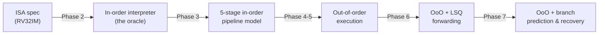
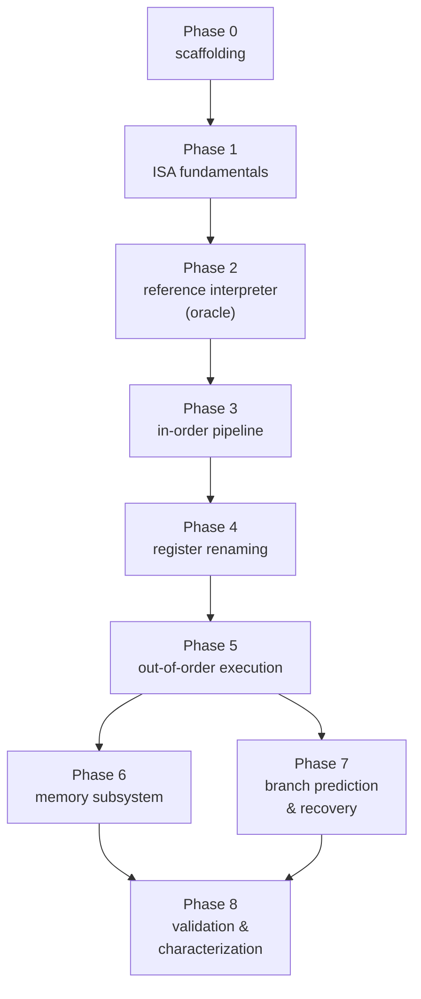

<div align="center">

# Build Plan

**Implementation roadmap for [`DESIGN.md`](./DESIGN.md)**

38 steps · one source file and one test file per step

</div>

---

## Contents

| Phase | Focus | Steps | Design ref |
|---|---|---|---|
| [0](#phase-0--scaffolding) | Scaffolding | 0.1–0.3 | — |
| [1](#phase-1--isa-fundamentals) | ISA fundamentals | 1.1–1.5 | [§10](./DESIGN.md#10-scope--future-work) |
| [2](#phase-2--the-reference-interpreter-your-oracle) | Reference interpreter (the oracle) | 2.1–2.3 | [§8.1](./DESIGN.md#81-differential-correctness) |
| [3](#phase-3--in-order-pipeline) | In-order pipeline | 3.1–3.5 | [§2](./DESIGN.md#2-system-architecture) |
| [4](#phase-4--register-renaming) | Register renaming | 4.1–4.5 | [§3](./DESIGN.md#3-register-renaming) |
| [5](#phase-5--out-of-order-execution) | Out-of-order execution | 5.1–5.6 | [§4](./DESIGN.md#4-issue-queue) |
| [6](#phase-6--memory-subsystem) | Memory subsystem | 6.1–6.3 | [§5](./DESIGN.md#5-memory-subsystem) |
| [7](#phase-7--branch-prediction--recovery) | Branch prediction & recovery | 7.1–7.5 | [§6](./DESIGN.md#6-branch-prediction--recovery) |
| [8](#phase-8--validation--characterization) | Validation & characterization | 8.1–8.4 | [§8](./DESIGN.md#8-testing--validation), [§9](./DESIGN.md#9-performance-characterization) |

Supporting material: [How to use this plan](#how-to-use-this-plan) · [The oracle strategy](#the-oracle-strategy) ·
[Environment](#environment) · [Repo layout](#repo-layout) · [Test conventions](#test-conventions) ·
[Dependency graph](#dependency-graph)

---

## How to use this plan

Every step is the same loop. Do them in order; each one is small enough to finish in a sitting
and leaves the repo in a green state.

```
1. READ    the DESIGN.md section the step cites — before writing any code
2. PREDICT write down what you expect the test to show (a cycle count, IPC, a stall cause)
3. WRITE   the one source file
4. TEST    the one test file, run it, and reconcile it against your prediction
5. COMMIT  only when the step's "Done when" criteria all hold
```

Step 2 is the part people skip and the part that produces the learning. If a stall breakdown
says "IQ-full" when you expected "ROB-full", you have found either a bug or a gap in your
mental model, and it is worth stopping to work out which before moving on.

**Rules that keep the plan honest**

- **One source file per step.** If a step seems to need two, the step is wrong — split it.
- **Never delete a working slower path.** The in-order interpreter from Phase 2 becomes the
  oracle for every Phase 3–7 result. That is the backbone of the whole plan.
- **The test suite only grows.** A step is not done if it broke an earlier test.
- **Measure only after correct.** Every microarchitectural change is compared for correctness
  against the reference *before* its IPC is reported.

---

## The oracle strategy

The central difficulty in a CPU simulator is that a wrong answer often still looks like a
plausible instruction trace. The pipeline "runs", registers change, the program exits — but
some register is off by one because a stale mapping was reclaimed too early. You cannot
eyeball correctness. So the plan is built around **differential testing**: every complex
out-of-order component is checked against a simple, obvious one that already passed.



Each arrow is a test — the same 13 workloads driven through both layers, comparing all 32
architectural registers, the exit code, and the committed instruction count. The chain means a
Phase 7 bug can be bisected by walking backwards until a layer agrees with the reference again,
which localizes the fault to one hop.

Two consequences worth internalizing:

- **Phase 2 exists only to build the oracle.** It ships no feature from the design doc.
  Skipping it makes every later phase untestable — you would be comparing an OoO model against
  itself, which cannot catch a systematic bug.
- **Register-state comparison is your friend.** At `exit`, two correct implementations must
  produce **identical** values in all 32 architectural registers *and* the same committed
  instruction count. That is a far sharper signal than eyeballing a trace.

---

## Environment

| Component | Requirement | Consequence for the plan |
|---|---|---|
| Toolchain | C++17, any GCC ≥ 9 or Clang ≥ 10 | Modern lambdas, `std::optional`, structured bindings |
| Build | `make` | Single Makefile; no CMake / Bazel machinery to fight |
| Sanitizers | ASan + UBSan | `make debug` builds run the full suite instrumented — catches the free-list double-frees that a functional test misses |
| RISC-V toolchain | **not required** | `tests/asm.h` is an in-process mini-assembler; `tools/gen_examples.cpp` emits `.hex` |
| ELF32 loader | in-tree | Optional — `.hex` and `--raw` cover every test; ELF is only for real toolchain output |

**On writing the assembler in the test tree.** A `riscv32-unknown-elf-gcc` dependency turns a
five-minute clone-and-build into a half-hour toolchain hunt. The in-tree assembler covers RV32I
+ M and pseudoinstructions — enough for every workload the simulator is validated against —
in a few hundred lines. `--elf` remains the escape hatch for anyone who wants to run their own
compiled programs.

---

## Repo layout

The end state. Create directories as their first file arrives, not up front.

```text
Mini-CPU/
├── Makefile                    0.1
├── src/
│   ├── types.h                 0.2
│   ├── config.h                0.3
│   ├── decoder.h               1.1
│   ├── decoder.cpp             1.1
│   ├── alu.h                   1.2
│   ├── memory.h                1.3
│   ├── loader.h                1.4
│   ├── main.cpp                1.5, 8.4
│   ├── rob.h                   3.2
│   ├── prf.h                   4.1
│   ├── freelist.h              4.2
│   ├── rat.h                   4.3, 7.4
│   ├── issue_queue.h           5.1
│   ├── lsq.h                   6.1
│   ├── bpred.h                 7.1, 7.2, 7.3
│   ├── stats.h                 8.1
│   ├── cpu.h                   3.1, 3.3, 3.4, 3.5, 4.4, 4.5, 5.2-5.6, 6.2, 6.3, 7.5
│   └── cpu.cpp                 (extends with each step above)
├── tests/
│   ├── asm.h                   2.1
│   ├── ref.h                   2.2
│   ├── workloads.h             2.3, shared with tools/
│   └── test_main.cpp           2.3 + one @section per later step
└── tools/
    └── gen_examples.cpp        8.4
examples/                       generated
```

**Why `cpu.{h,cpp}` accumulates across the plan.** The seven stages are one state machine —
splitting them into seven files would force `friend` declarations across every private data
member and lose the property that `tick()` is one readable function. Each pipeline stage step
adds one method (`Cpu::fetch`, `Cpu::decode_stage`, …) and extends `tick()` by one line. If
the file feels too large by Phase 7, that is the moment to split — not before.

---

## Test conventions

Established once in [Step 2.3](#step-23--test-harness--differential-runner) and used by every later step.

| Kind | Meaning | Invoked by |
|---|---|---|
| **Reference-diff** | Run workload through both `Cpu` and `ref.h`; compare arch regs, exit code, retired count | `make test` |
| **Property assertion** | A specific microarchitectural invariant (back-to-back issue, no wrong-path retire) | `make test` |
| **Configuration sweep** | Same workload across the six configurations from [§8.2](./DESIGN.md#82-configuration-sweep) | `make test` |
| **Sanitized run** | Whole suite under ASan + UBSan | `make debug` |

Conventions that pay off later:

- **Deterministic simulation.** No wall-clock time, no `rand()` — every tie-break is
  age-ordered or index-ordered. A failure at cycle 41,382 must reproduce on the next run,
  bit-identical, or debugging is dead.
- **Every test is a differential test until proven otherwise.** Only assert absolute numbers
  (e.g. "≤ 260 cycles") in the microarchitectural property tests, and only when the number is
  the point of the test.
- **`--trace` is a first-class debug tool.** Add it in [Step 1.5](#step-15--main-driver--cli); every later step should be
  reproducible from a trace diff.

---

## Phase 0 — Scaffolding

Three steps, then you never think about tooling again.

#### Step 0.1 — Makefile & warning flags

**Write** `Makefile` · **Test** `make && ./build/oooc --help` prints usage

- Targets: `build/oooc`, `make test`, `make debug`, `make clean`.
- Flags: `-std=c++17 -O2 -Wall -Wextra -Wpedantic`; the `debug` target adds
  `-fsanitize=address,undefined -g -O1`.
- Auto-regenerate `examples/*.hex` from `tools/gen_examples.cpp` as a prerequisite of `test`.

**Done when:** `make` produces `build/oooc` with no warnings; `make debug` produces
`build/oooc-debug` under ASan+UBSan; `make clean` returns the tree to a pristine state.

#### Step 0.2 — Fundamental types

**Write** `src/types.h` · **Test** `tests/test_main.cpp @section("types")`

- `uint32_t` aliases: `PhysReg`, `ArchReg`, `RobIndex`, `SeqNum`. `constexpr` `INVALID_*`
  sentinels rather than `-1` sprinkled through the code.
- `enum class` `OpKind { ALU, BRANCH, MUL, DIV, LOAD, STORE, NOP, TRAP }` — the class that
  drives every FU-routing decision from Phase 5 onward.

**Done when:** the header compiles standalone; the sentinels round-trip through the
`std::optional` idiom used by [Step 4.2](#step-42--free-list).

#### Step 0.3 — Config

**Write** `src/config.h` · **Test** `tests/test_main.cpp @section("config")`

- A POD struct: `width`, `rob_size`, `prf_size`, `iq_size`, `lq_size`, `sq_size`,
  `num_cdb`, per-class FU counts, per-class latencies, `ghr_bits`, `pht_size`, `btb_sets`,
  `btb_ways`, `ras_size`, `num_checkpoints`, `mem_latency`.
- `bool prf_can_starve() const { return prf_size < rob_size + 32; }` — the invariant call-out
  from [§3.2](./DESIGN.md#32-sizing-and-starvation).
- Defaults matching [§9.1](./DESIGN.md#91-default-configuration).

**Done when:** every knob is one field; `prf_can_starve()` returns `false` for the default and
`true` for `--prf 32`; nothing downstream will hardcode a size.

> **Learn:** every configurability decision starts as a `Config` field. The temptation to
> hardcode "just 16 IQ entries for now" is the temptation to rewrite Phase 5.

---

## Phase 1 — ISA fundamentals

Everything that touches the ISA and nothing that touches the pipeline. These files stay stable
from Phase 1 through Phase 8 — the OoO machinery is layered on top without changing decode or
the functional model.

Design reference: [§10](./DESIGN.md#10-scope--future-work).

#### Step 1.1 — Decoder

**Write** `src/decoder.h`, `src/decoder.cpp` · **Test** `tests/test_main.cpp @section("decode")`

- One `Decoded` struct: opcode, `OpKind`, `rd`/`rs1`/`rs2` (architectural), immediate,
  `is_branch`, `is_load`, `is_store`, latency-class tag.
- Cover RV32I + M. `FENCE`/`FENCE.I` decode as `OpKind::NOP`. `ECALL`/`EBREAK` decode as
  `OpKind::TRAP`.
- Sign-extend immediates *once*, in the decoder — never at a use site.

**Done when:** a hand-picked set of 40+ instructions (all formats, both extension halves)
decode to the expected struct; unknown opcodes produce a `TRAP` rather than undefined behavior.

#### Step 1.2 — ALU / functional model

**Write** `src/alu.h` · **Test** `tests/test_main.cpp @section("alu")`

- One pure function per `OpKind::ALU` variant: `add`, `sub`, `sll`, `srl`, `sra`, `and`, `or`,
  `xor`, `slt`, `sltu`. Same for M: `mul`, `mulh`, `mulhu`, `mulhsu`, `div`, `divu`, `rem`,
  `remu` — including the RISC-V divide-by-zero and signed-overflow definitions (a bug magnet).
- Branch condition helpers: `beq`, `bne`, `blt`, `bge`, `bltu`, `bgeu`.

**Done when:** every operation has a two-line test case, including `div -2147483648, -1`
(defined result is `-2147483648`, not a trap) and `div x, 0` (defined as `-1`).

> **Learn:** the div edge cases are in the ISA manual for a reason. Getting them wrong here
> shows up in Phase 7 as a "spurious mispredict" that took two hours to bisect.

#### Step 1.3 — Memory

**Write** `src/memory.h` · **Test** `tests/test_main.cpp @section("memory")`

- Paged flat memory (`std::unordered_map<uint32_t, page>` where `page` is a 4KiB byte array).
  Load/store at byte / half / word granularity.
- Misaligned accesses are honoured (RV32IM permits misaligned; no trap).

**Done when:** a store of `0xDEADBEEF` at `0x1002` (misaligned) reads back correctly as one
`lw`, two `lh`s, or four `lb`s; touching a fresh page allocates it lazily.

#### Step 1.4 — Program loaders

**Write** `src/loader.h` · **Test** `tests/test_main.cpp @section("loader")`

- Three input formats:
  - **`.hex`** — plain hex words, one per line, base `0x0` unless `--base` is given.
  - **`--raw`** — raw binary at `--base`.
  - **ELF32** — walk the program headers, load `PT_LOAD` segments, honour segment permissions
    only far enough to fault a store to a read-only region.

**Done when:** loading a program via each format lands the same bytes at the same addresses
(round-trip a small program through all three).

#### Step 1.5 — Main driver + CLI

**Write** `src/main.cpp` · **Test** `tests/test_main.cpp @section("cli")`

- Parse `--hex` / `--raw` / positional ELF / `--base` / `--regs` / `--trace` / every `Config`
  field as `--width`, `--rob`, etc.
- Not yet a CPU — for now, load the program, run it through the reference interpreter (added
  in [Step 2.2](#step-22--in-order-reference-interpreter)), print exit code and (optionally) registers.

**Done when:** `./build/oooc --hex prog.hex --regs` prints exit and registers; `--help` lists
every knob; every `Config` field has a `--flag`.

---

## Phase 2 — The reference interpreter (your oracle)

This phase adds **no feature from the design doc**. Its entire purpose is to produce a
known-correct, in-order interpreter that every later phase is tested against. Skipping it is
the single most likely way to end up with a simulator that produces plausible garbage.

Design reference: [§8.1](./DESIGN.md#81-differential-correctness).

#### Step 2.1 — In-tree assembler

**Write** `tests/asm.h` · **Test** `tests/test_main.cpp @section("asm")`

- Header-only assembler covering RV32I + M plus pseudoinstructions (`li`, `mv`, `nop`, `j`,
  `jr`, `ret`, `call`). Emit into a `std::vector<uint32_t>`.
- Two-pass over labels so forward branches resolve.

**Done when:** every instruction the tests in [Step 2.3](#step-23--test-harness--differential-runner) will emit assembles to a
byte-exact match against a hand-checked reference table.

> **Learn:** avoiding a RISC-V toolchain dependency at the *test* boundary is what keeps the
> project cloneable in five minutes. This is worth the two hundred lines.

#### Step 2.2 — In-order reference interpreter

**Write** `tests/ref.h` · **Test** `tests/test_main.cpp @section("ref")`

- Straight interpreter: fetch, decode ([Step 1.1](#step-11--decoder)), execute ([Step 1.2](#step-12--alu--functional-model)), commit — one
  instruction per iteration, no pipeline model at all.
- Honour `a7 == 93` at `ECALL` as `exit(a0)`.

**Done when:** a handful of `.hex` programs (arithmetic, loop, load/store, function call, div)
run to completion with expected exit codes; a divide-by-zero does not crash the host.

#### Step 2.3 — Test harness + differential runner

**Write** `tests/test_main.cpp` · **Test** *(itself)*

- One driver, one `@section(name)` macro per group of assertions, `make test` runs the whole
  file.
- A `diff_run(prog, config)` helper that runs the program through `Cpu` (once Phase 3 exists)
  and `ref.h`, comparing all 32 architectural registers, `a0`, and retired-instruction count.

**Done when:** the harness compiles and runs; a placeholder `@section("diff_scaffold")` that
compares `ref.h` against itself passes trivially — proving the compare logic works before any
`Cpu` implementation exists to compare against.

> **Learn:** the compare logic passing against itself is the sanity check that catches a
> bug in `diff_run` itself. If you introduced `Cpu` first and the diff failed, you would not
> know whether the bug is in the CPU or the harness.

---

## Phase 3 — In-order pipeline

Now the pipeline scaffolding — but still **in-order**, no renaming, no OoO. This is the shell
into which every Phase 4–7 mechanism is grafted, and testing it thoroughly is what makes
adding out-of-order machinery a series of localized changes instead of a rewrite.

Design reference: [§2](./DESIGN.md#2-system-architecture).

#### Step 3.1 — `Cpu` scaffold: state, latches, `tick()` skeleton

**Write** `src/cpu.h`, `src/cpu.cpp` · **Test** `tests/test_main.cpp @section("cpu_tick")`

- Class `Cpu` owning: registers (architectural for now), PC, memory reference, and the
  fetch/decode/execute/writeback/commit latches as `std::optional<T>` or a `std::deque<T>`.
- `tick()` evaluates stages in **reverse pipeline order** ([§2](./DESIGN.md#2-system-architecture)) — commit before writeback
  before execute before decode before fetch.

**Done when:** `Cpu` with no instructions ticks forever without progress; ticking with a single
`addi` produces the expected register write after exactly the pipeline depth (5 cycles at this
phase) with no wrong-path side effects.

#### Step 3.2 — Reorder buffer (in-order variant)

**Write** `src/rob.h` · **Test** `tests/test_main.cpp @section("rob")`

- Circular buffer of `RobEntry { seq, pc, dest_arch, is_branch, is_store, complete, ... }`,
  size from `Config::rob_size`.
- API: `allocate`, `at(idx)`, `head`, `tail`, `pop_head_if_complete`, `full()`, `truncate_to(idx)`.
- Sequence numbers are strictly monotonic — this is what "older than" means everywhere else.

**Done when:** filling and draining the ROB works at every wrap boundary; `truncate_to`
correctly restores the tail and returns the range of squashed sequence numbers for later
recovery passes to iterate.

#### Step 3.3 — Fetch / Decode

**Write** `src/cpu.cpp` (extend) · **Test** `tests/test_main.cpp @section("frontend")`

- Fetch reads `Config::width` words from memory per cycle from PC and produces a fetch bundle.
- Decode consumes the fetch bundle and produces `Decoded` records into the decode-latch queue.
- Both stages back-pressure cleanly when the downstream latch is full.

**Done when:** a program of 20 back-to-back `addi`s produces the expected decode records in
program order at the expected rate given `width`.

#### Step 3.4 — Execute (in-order, one FU per class)

**Write** `src/cpu.cpp` (extend) · **Test** `tests/test_main.cpp @section("execute_inorder")`

- Read operands from the architectural register file, execute via `alu.h`, produce a
  writeback record with the result and destination architectural register.
- Multi-cycle ops (mul, div, load) are modelled by a per-FU "busy until cycle X" counter.

**Done when:** an in-order run of every Phase-2 workload produces the same registers and exit
code as `ref.h`. **This is the first end-to-end differential pass.**

#### Step 3.5 — Writeback + Commit

**Write** `src/cpu.cpp` (extend) · **Test** `tests/test_main.cpp @section("commit_inorder")`

- Writeback moves a completed op's result into the register file.
- Commit retires the ROB head in program order, updates the architectural PC, and — for stores
  — this is where the store actually mutates memory.

**Done when:** memory writes appear in program order under a workload with dependent
store-then-load pairs; the retired-instruction count matches `ref.h` exactly.

> **Learn:** with a working in-order pipeline you now have two oracles: `ref.h` for
> ISA semantics, and the Phase 3 `Cpu` for pipeline mechanics. When a Phase-5 out-of-order
> failure emerges, the in-order path is the "does the mechanism, not the OoO logic, work"
> bisection point.

---

## Phase 4 — Register renaming

The design doc's core intellectual move. The key trick is [Step 4.4](#step-44--rename-stage): once the PRF, free list,
and RAT exist as independently tested data structures, wiring them into the pipeline is one
stage's worth of code, and it correctly removes WAW and WAR hazards by construction.

Design reference: [§3](./DESIGN.md#3-register-renaming).

#### Step 4.1 — Physical register file

**Write** `src/prf.h` · **Test** `tests/test_main.cpp @section("prf")`

- `std::vector<uint32_t>` of size `Config::prf_size`, plus a `ready` bit per register.
- API: `read(PhysReg)`, `write(PhysReg, uint32_t)` (sets ready), `is_ready(PhysReg)`, `reset()`.
- `p0` is hard-wired to zero (the reset mapping for `x0` from [§3.3](./DESIGN.md#33-the-x0-special-case)).

**Done when:** basic read/write/ready round-trips work; writing `p0` is a no-op (the class
enforces the `x0` invariant, not the callers).

#### Step 4.2 — Free list

**Write** `src/freelist.h` · **Test** `tests/test_main.cpp @section("freelist")`

- A `std::deque<PhysReg>` initialized with every physical register except those preassigned to
  the initial RAT (`p1..p31` map to `x1..x31`; `p0` reserved for `x0`; the rest are free).
- `alloc()` returns `std::optional<PhysReg>` (empty when starved). `free(PhysReg)` pushes back.

**Done when:** the invariant `|free| + |mapped_by_rat| + |in_rob_as_stale| = prf_size` holds
after an arbitrary sequence of alloc/free operations; a stress test with `prf_size < rob + 32`
observes real starvation and reports it.

#### Step 4.3 — Register alias table

**Write** `src/rat.h` · **Test** `tests/test_main.cpp @section("rat")`

- `std::array<PhysReg, 32>` mapping architectural to physical.
- API: `map(ArchReg) -> PhysReg`, `set(ArchReg, PhysReg)`. Include a checkpoint pool — a
  bounded ring of full RAT snapshots — for use in [Step 7.4](#step-74--branch-checkpoints--rat--ghr--ras).
- `set(0, _)` is a no-op ([§3.3](./DESIGN.md#33-the-x0-special-case)); this class enforces the invariant, not its callers.

**Done when:** a checkpoint restored after arbitrary writes reproduces the RAT bit-identical
to its snapshot; the checkpoint pool refuses allocation when full rather than overwriting the
oldest snapshot.

#### Step 4.4 — Rename stage

**Write** `src/cpu.cpp` (extend) · **Test** `tests/test_main.cpp @section("rename")`

- For each decoded op reaching Rename: look up sources in the RAT, allocate a fresh PhysReg
  for `rd` (unless `rd == 0`), record the **stale** mapping in the ROB entry, update the RAT.
- Stall Rename if the free list is empty *or* the ROB is full.

**Done when:** a program with reused destination registers renames each to a distinct
`PhysReg`; a program writing `x0` allocates **zero** physical registers; the reference-diff
still passes end-to-end.

#### Step 4.5 — Commit-time reclamation

**Write** `src/cpu.cpp` (extend) · **Test** `tests/test_main.cpp @section("reclaim")`

- On commit, return the ROB entry's stale mapping to the free list — the *only* place
  registers are freed on the correct path ([§3.1](./DESIGN.md#31-r10000-style-explicit-renaming)).

**Done when:** the free-list invariant holds across a full run; a WAW/WAR renaming stress test
matches `ref.h` and the free list returns to its initial state at exit.

> **Learn:** stale-at-commit reclamation is why WAW is truly gone rather than "usually gone" —
> two writers to the same architectural reg cannot alias physical storage, regardless of
> execution order. Free-at-writeback (a tempting simplification) breaks this and produces the
> classic "value corrupted by a later mispredicted instruction" bug.

---

## Phase 5 — Out-of-order execution

The whole payoff. With renaming in place, dependencies are physical-tag matches and execution
order is free. This phase adds the issue queue, per-FU dispatch, and the CDB arbiter; commit
stays in order (the Phase-3 mechanism, unchanged).

Design reference: [§4](./DESIGN.md#4-issue-queue).

#### Step 5.1 — Non-data-capture issue queue

**Write** `src/issue_queue.h` · **Test** `tests/test_main.cpp @section("iq")`

- Entries hold `{seq, op_kind, dest_phys, src1_phys, src1_ready, src2_phys, src2_ready,
  latency, ...}`. **No value fields.** Values come from the PRF at select ([§4.1](./DESIGN.md#41-non-data-capture)).
- API: `insert(entry)`, `wakeup(PhysReg)` sets the ready bit on every waiter,
  `select(width) -> vector<Entry>` returning the oldest ready entries bounded by width.

**Done when:** a hand-built dependency chain (`a` produces `p5`, `b` waits on `p5`) shows `b`
enter the ready set the cycle after `wakeup(p5)`; select returns entries in program (sequence)
order when multiple are ready.

#### Step 5.2 — Dispatch stage

**Write** `src/cpu.cpp` (extend) · **Test** `tests/test_main.cpp @section("dispatch")`

- After Rename, insert the op into the IQ, and — because [Step 6.1](#step-61--load--store-queues) will need it — assign it an
  LQ or SQ index if it is a load or store.
- Stall Dispatch if IQ is full (report it via [Step 8.1](#step-81--stall-cause--fu-statistics) counters, not as a silent stall).

**Done when:** the IQ and (later) LSQ occupancy matches an expected trace on a small program.

#### Step 5.3 — Issue stage (age-ordered select)

**Write** `src/cpu.cpp` (extend) · **Test** `tests/test_main.cpp @section("issue")`

- Each cycle, pick up to `Config::width` ready entries, prioritizing oldest, subject to
  per-class FU port availability ([§4.4](./DESIGN.md#44-select-policy)).
- Read operands from the PRF as part of the transition to Execute (this is what "non-data-capture"
  means at the pipeline level).

**Done when:** two independent instructions in the IQ issue in the same cycle on a 2-wide
config; three independent ALU ops on `num_alu=2` cause exactly one to defer to the next cycle,
and the deferred cause is logged as `alu_port_full`.

#### Step 5.4 — Execute (multi-FU) + CDB reservation for fast ops

**Write** `src/cpu.cpp` (extend) · **Test** `tests/test_main.cpp @section("execute_ooo")`

- Route by `OpKind` to per-class FU pools (ALU / branch / mul / div / mem). Fast-latency ops
  (ALU / branch / mul / div — everything with a known latency at issue) `reserve_cdb(cycle_of_wb)`
  at issue time ([§4.3](./DESIGN.md#43-two-wakeup-paths)).
- An op that cannot reserve its CDB slot does **not** issue — count that stall as `cdb_reserved_full`.

**Done when:** a workload contrived to have two ALU ops finishing the same cycle on a 1-CDB
config sees one of them delay issue by a cycle rather than piling up at writeback.

#### Step 5.5 — Writeback + intra-cycle wakeup

**Write** `src/cpu.cpp` (extend) · **Test** `tests/test_main.cpp @section("wakeup_fast")`

- Writeback broadcasts the tag *before* Issue runs in the same cycle ([§4.2](./DESIGN.md#42-wakeup-and-select-in-one-atomic-cycle)) — this falls
  out of the reverse-order stage evaluation from [Step 3.1](#step-31--cpu-scaffold-state-latches-tick-skeleton), which is why that step mattered.
- Loads (Phase 6) will broadcast after winning a CDB in the arbiter; for now every op is a
  fast op.

**Done when:** the marquee assertion holds — **200 dependent `addi`s on a 1-wide machine
complete in under 260 cycles** ([§4.2](./DESIGN.md#42-wakeup-and-select-in-one-atomic-cycle)). Without intra-cycle wakeup, the same test runs in
~460 cycles; the boundary between these numbers is the property test.

#### Step 5.6 — Commit (unchanged, but re-verify)

**Write** `src/cpu.cpp` (extend) · **Test** `tests/test_main.cpp @section("commit_ooo")`

- Commit retires ROB entries in order, publishes results to architectural state, and
  reclaims stale mappings ([Step 4.5](#step-45--commit-time-reclamation)).
- Verify that **no wrong-path instruction retires** — the retired-instruction count in a
  workload with branches must match `ref.h` exactly.

**Done when:** all thirteen validation workloads pass differential compare against `ref.h` on
the default config, with commit strictly in order.

---

## Phase 6 — Memory subsystem

Design reference: [§5](./DESIGN.md#5-memory-subsystem). Loads and stores need special treatment because store data
is not committed until commit-time, so a younger load must consult the store queue rather than
memory. Get this wrong and the symptom is a load reading a stale value from memory that the
store queue was supposed to shadow.

#### Step 6.1 — Load & store queues

**Write** `src/lsq.h` · **Test** `tests/test_main.cpp @section("lsq")`

- Two queues, entries allocated **at dispatch** ([§5.1](./DESIGN.md#51-lsq-ordering)) so "older than me" is an index
  comparison. Entries hold `{seq, addr, addr_ready, data, data_ready, size, ...}`.
- API: `alloc_load`, `alloc_store`, `resolve_addr(idx, addr)`, `resolve_data(idx, data)`,
  `search_older_stores(load_idx) -> ForwardResult`.

**Done when:** the search returns `Forward(data)` for a fully-covering resolved store,
`Replay` for an unresolved older store or a partial overlap, and `NoMatch` when no older store
aliases the load's address.

#### Step 6.2 — Load pipeline + slow-path wakeup

**Write** `src/cpu.cpp` (extend) · **Test** `tests/test_main.cpp @section("load_forward")`

- On Execute for a load: compute address, call `lsq.search_older_stores`. On `Forward`,
  writeback immediately with the forwarded data. On `Replay`, retry in place next cycle. On
  `NoMatch`, read memory (after `mem_latency` cycles).
- Loads cannot reserve a CDB at issue ([§4.3](./DESIGN.md#43-two-wakeup-paths)) — they arbitrate at writeback.

**Done when:** a `sw x1, 0(x2); lw x3, 0(x2)` sequence forwards without touching memory; a
`sw` with an unresolved base + `lw` at a resolved-to-alias address replays until the store
address resolves, then completes.

#### Step 6.3 — Commit-time store issue

**Write** `src/cpu.cpp` (extend) · **Test** `tests/test_main.cpp @section("store_commit")`

- Stores retire from the SQ *in order at commit* ([§5.1](./DESIGN.md#51-lsq-ordering)); only then do they mutate memory.
  On mispredict recovery, unresolved younger SQ entries are dropped — their commit will
  never fire.

**Done when:** dependent load–store–load patterns and sub-word / partial-overlap tests match
`ref.h`; a workload with a mispredicted branch guarding a store correctly leaves memory
untouched.

> **Learn:** the "stores mutate memory only at commit" invariant is what makes precise
> exceptions and mispredict recovery mechanically simple later. Every design that "just
> writes memory at writeback and undoes it later" has to solve a much harder problem.

---

## Phase 7 — Branch prediction & recovery

The most intricate phase, and where the checkpoint machinery from [Step 4.3](#step-43--register-alias-table) pays off. Every
step here has a `ref.h` differential check as its correctness backstop and an MPKI number as
its performance signal.

Design reference: [§6](./DESIGN.md#6-branch-prediction--recovery).

#### Step 7.1 — gshare direction predictor

**Write** `src/bpred.h` · **Test** `tests/test_main.cpp @section("gshare")`

- 12-bit GHR (default), 4096-entry PHT of 2-bit saturating counters, indexed by
  `(GHR XOR (PC >> 2)) & (PHT_SIZE - 1)` ([§6.1](./DESIGN.md#61-direction-gshare)).
- Predict at Fetch, update the PHT at Commit.

**Done when:** on a regular tight loop, gshare converges to ≤1% mispredict rate within a few
hundred iterations, and it beats a coin-flip baseline by a measurable margin.

#### Step 7.2 — BTB (PC-tagged, set-associative)

**Write** `src/bpred.h` (extend) · **Test** `tests/test_main.cpp @section("btb")`

- 4-way set-associative, PC-tagged, LRU replacement, 512 entries default. Cold misses fall
  through to sequential fetch — a real property of hardware BTBs and the source of a specific
  category of bug if you skip it ([§6.2](./DESIGN.md#62-targets-btb-and-ras)).
- Update at Commit only.

**Done when:** a first-time-seen indirect branch is not predicted and is corrected at Execute;
after one commit, the target is cached and the following fetch is redirected on hit.

#### Step 7.3 — Return address stack

**Write** `src/bpred.h` (extend) · **Test** `tests/test_main.cpp @section("ras")`

- 16-entry stack; push on `jal` writing `x1`/`x5`, pop on `jalr` reading `x1`/`x5` ([§6.2](./DESIGN.md#62-targets-btb-and-ras)).
- Snapshotted **at Fetch** (see [§6.4](./DESIGN.md#64-misprediction-recovery)), not Rename — younger fetches mutate it before an
  older branch's checkpoint is captured.

**Done when:** recursive `fib(10)` predicts every return correctly after the first activation
of each depth; a nested-call test drops MPKI substantially versus disabling the RAS.

#### Step 7.4 — Branch checkpoints (RAT + GHR + RAS)

**Write** `src/rat.h` (extend), `src/cpu.cpp` (extend) · **Test** `tests/test_main.cpp @section("checkpoint")`

- Extend the RAT checkpoint pool from [Step 4.3](#step-43--register-alias-table) to also snapshot GHR and RAS at the right
  stage ([§6.4](./DESIGN.md#64-misprediction-recovery)): **RAT in Rename** (after the branch's own destination is mapped), **GHR
  and RAS in Fetch**.
- Exhausting the checkpoint pool stalls Rename on the next branch (counted as
  `checkpoint_starved`).

**Done when:** checkpoint pressure under a branch-dense workload shows up as a stall rather
than as a silent overwrite; on a starved config, the reported cause matches expectation.

#### Step 7.5 — Recovery

**Write** `src/cpu.cpp` (extend) · **Test** `tests/test_main.cpp @section("recover")`

- On the *oldest* misprediction detected at Execute, run `handle_recovery`:
  1. Return every younger ROB entry's destination to the free list, youngest first, and truncate.
  2. Squash younger IQ / FU / WB / LQ / SQ entries; release their booked CDBs.
  3. Restore RAT / GHR / RAS from the branch's checkpoint; then shift GHR by the *true* outcome.
  4. Flush front-end latches, redirect Fetch.

**Done when:** on every branch-heavy workload, the reference-diff still passes and the
retired-instruction count matches `ref.h`; the LCG-driven unpredictable branch triggers many
mispredicts *without* leaking free-list entries or checkpoint slots over the run.

> **Learn:** freeing the destination of a younger squashed op returns *its* mapping, not the
> stale it displaced. The stale is still in-flight in an older ROB entry (or already
> committed) and will reclaim itself at its own commit. Getting this direction wrong is the
> canonical recovery bug and its symptom is a silently corrupted register two hundred cycles
> later.

---

## Phase 8 — Validation & characterization

Turn [§9](./DESIGN.md#9-performance-characterization) into numbers you can actually cite.

#### Step 8.1 — Stall-cause & FU statistics

**Write** `src/stats.h` · **Test** `tests/test_main.cpp @section("stats")`

- Per-stage uop counts, IPC/CPI, mispredict rate, MPKI, BTB hit rate, RAS accuracy, LSQ
  forwarding count, and a **stall-cause breakdown** attributing lost issue slots to each of:
  ROB-full, physreg starved, checkpoint starved, IQ-full, LQ/SQ-full, ALU/branch/mul/div/mem
  port full, CDB-reserved full.

**Done when:** a deliberately starved config (`ROB=4 IQ=2 LQ=SQ=1 chkpt=1`) reports **the
correct dominant cause** for each workload — sieve is ROB-limited, `crc32` is mispredict-limited,
`matmul` is IQ-limited before wide issue helps. The stall breakdown is not decorative; it must
diagnose.

#### Step 8.2 — Six-configuration sweep

**Write** `tests/test_main.cpp @section("config_sweep")` · **Test** *(itself)*

- Every workload runs on the six configurations from [§8.2](./DESIGN.md#82-configuration-sweep): default, 1-wide/1-CDB,
  4-wide/ROB=128, starved, long-latency, 1-entry predictors.

**Done when:** every (workload, config) pair matches `ref.h` on registers, exit code, and
retired count; a bug introduced in any renaming, wakeup, or recovery pathway shows up as a
**configuration-dependent** failure, which is the property [§8.2](./DESIGN.md#82-configuration-sweep) exists to exploit.

#### Step 8.3 — Microarchitectural property assertions

**Write** `tests/test_main.cpp @section("properties")` · **Test** *(itself)*

- The independent-of-`ref.h` invariants from [§8.3](./DESIGN.md#83-microarchitectural-property-assertions): 200 dependent `addi`s < 260
  cycles on 1-wide; load-use latency exactly `mem_latency`; store-queue forward and replay
  behaviour; starved-machine causes; gshare > random on regular loops.
- Plus the independent ISA check: `crc32` on `bytes(range(256))` matches zlib's `crc32`
  output byte-for-byte.

**Done when:** every property assertion passes at the default configuration and — for
config-dependent properties — on the configuration each one targets.

#### Step 8.4 — Example generator & IPC table

**Write** `tools/gen_examples.cpp`, extend `src/main.cpp` · **Test** *(prose)*

- `tools/gen_examples.cpp` assembles the bundled workloads (sieve, matmul, bubble_sort, fib,
  crc32) via [Step 2.1](#step-21--in-tree-assembler) into `examples/*.hex`.
- Extend the CLI to print the IPC-by-width table from [§9.2](./DESIGN.md#92-ipc-by-width) at end-of-run; measure and
  populate the DESIGN.md table with real numbers from your runs.

**Done when:** the IPC-by-width table in `DESIGN.md` is reproducible from `make test` on any
machine; a fresh clone-build-test cycle finishes in under a minute.

---

## Dependency graph

Where the plan is strictly ordered and where it is not.



**Phases 6 and 7 are independent of each other.** Both need a working out-of-order engine
from Phase 5; neither needs the other. If you want the payoff sooner, do Phase 7 first — the
recovery machinery is the intellectually richer result, and Phase 6 is the fiddlier
partial-overlap debugging.

**The one milestone that matters is [Step 5.6](#step-56--commit-unchanged-but-re-verify).** Before it you have components; after
it you have a working out-of-order machine, and every remaining step is a measurable
improvement to something that already runs.
